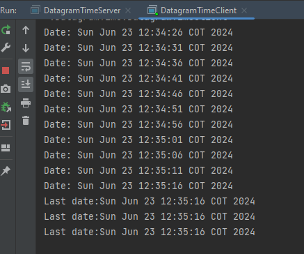

# Networking ARSW Project

This project contains several exercises focused on networking in Java. Each exercise demonstrates different networking concepts and must be run in an Integrated Development Environment (IDE). Below are the instructions for each exercise:

## Exercises

### Ejercicio 1

- **Description**: This exercise demonstrates how to fetch the content from a given URL and print its various components.
- **Instructions**:
  1. Run the `Ejercicio1` class in your IDE.
  2. When prompted, enter a URL.
  
**Acceptance test**


### Ejercicio 2

- **Description**: This exercise demonstrates how to fetch the content from a given URL.
- **Instructions**:
  1. Run the `Ejercicio2` class in your IDE.
  2. When prompted, enter a URL.

**Acceptance test**


### Ejercicio 3

- **Description**: This exercise demonstrates server-client communication where the client sends a number to the server.
- **Instructions**:
  1. First, run the `Ejercicio3` class in your IDE.
  2. It will ask you to enter a number. Provide the required input.
  3. Simultaneously, run the `WebSocketClient` class to handle the server-client communication. 

**Acceptance test**


### Ejercicio 4

- **Description**: This exercise extends the server-client communication to handle mathematical expressions, including the use of π (pi).
- **Instructions**:
  1. Run the `Ejercicio4` class in your IDE.
  2. Enter a number or a mathematical expression. For example, you can use `2*π` or `π/2`.
  3. Simultaneously, run the `WebSocketClient` class to handle the server-client communication.

**Acceptance test**


### Ejercicio 5

- **Description**: This exercise sets up a simple HTTP server that serves files and images.
- **Instructions**:
  1. Run the `Ejercicio5` class in your IDE.
  2. Access the server through a web browser.
  3. Try to make a search for one of the files located in "src/main/resources" by just 

**Acceptance test**


### DatagramTimeServer and DatagramTimeClient

- **Description**: This pair of exercises demonstrates the use of UDP datagrams for communication.
- **Instructions**:
  1. First, run the `DatagramTimeServer` class in your IDE.
  2. Then, run the `DatagramTimeClient` class to communicate with the server.

**Acceptance test**




### ChatServerImpl and ChatClientImpl

- **Description**: These exercises demonstrate the implementation of a simple chat application using RMI (Remote Method Invocation).
- **Instructions**:
  1. Run the `ChatServerImpl` class in your IDE to start the server.
  2. Run multiple instances of the `ChatClientImpl` class to connect to the server and participate in the chat.

**Acceptance test**


## Running the Exercises

1. **Open the Project**: Import the project into your preferred IDE (e.g., IntelliJ IDEA, Eclipse).
2. **Build the Project**: Ensure that your project builds successfully.
3. **Run the Classes**: Follow the instructions for each exercise to run the respective classes.

## Generating Javadoc

To generate the Javadoc for this project, use the following Maven command in the root directory of the project:

```bash
mvn javadoc:javadoc
```

The generated documentation will be available in the `apidocs` directory.

## Build and Author

This project was built using Java 11 and Maven.

**Author**: Juan Esteban Ortiz Pastrana
